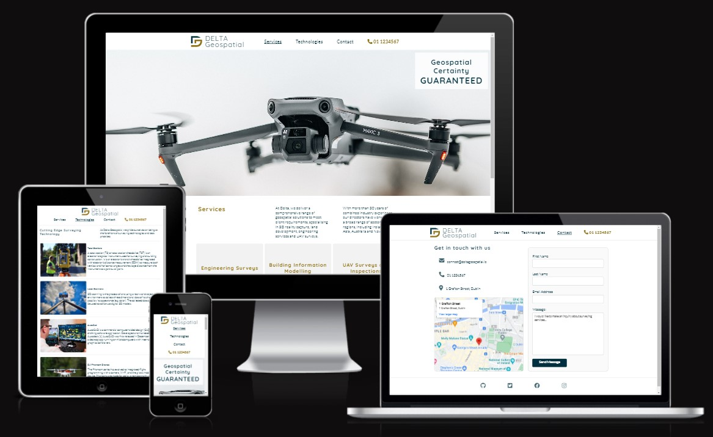
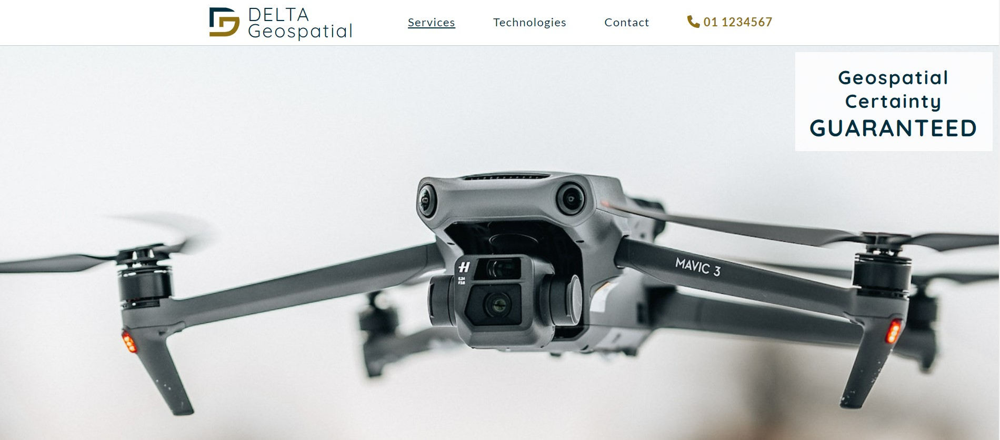
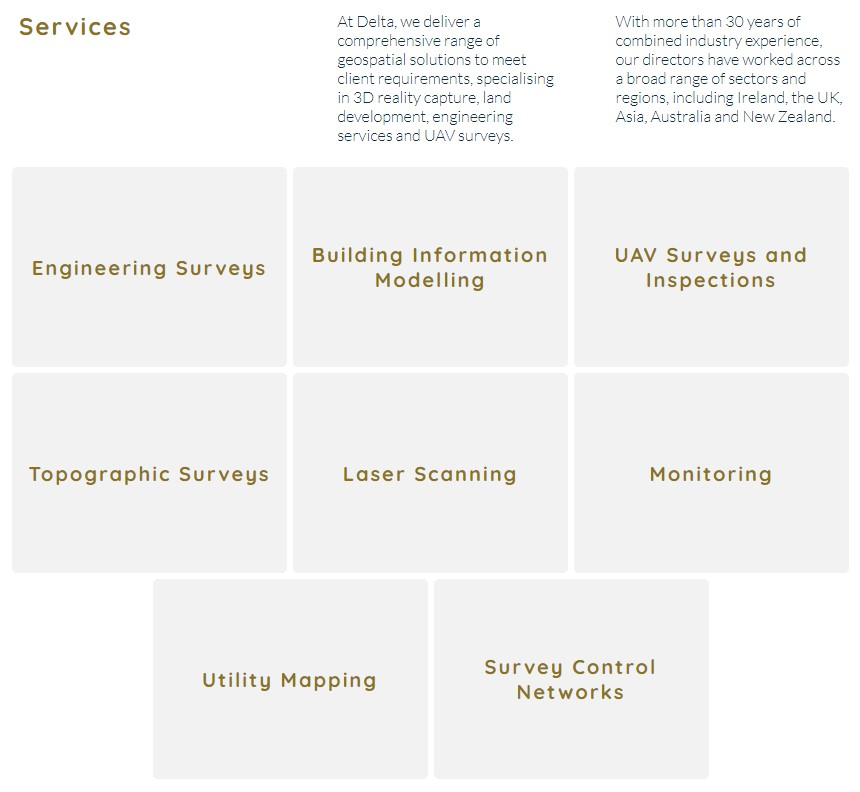
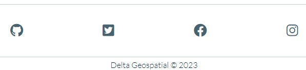
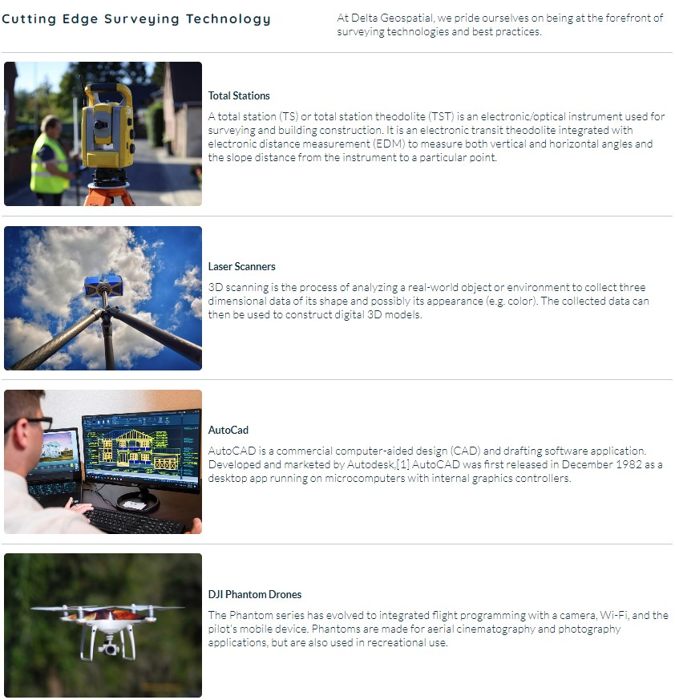
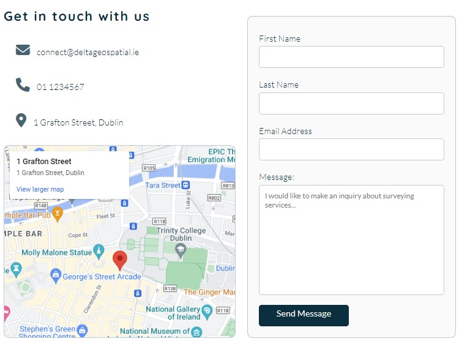
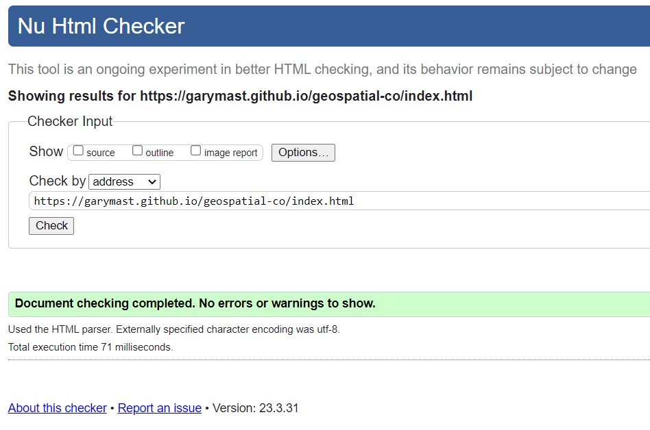
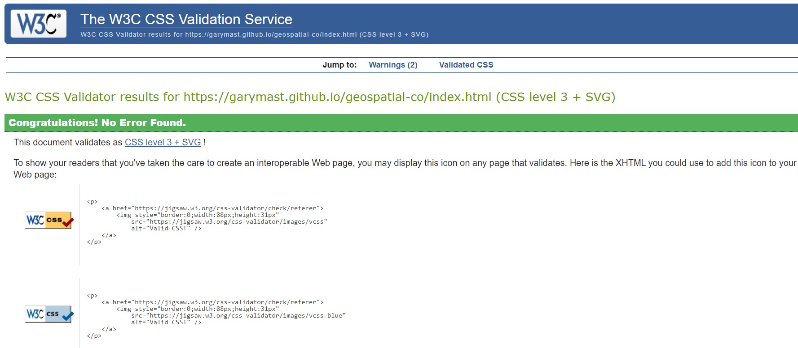

# Delta Geospatial

 A site for a geospatial surveying company based in Dublin.

It is a fully responsive website which can be viewed on multiple devices.

[Link To Live Website](https://garymast.github.io/geospatial-co/index.html)

## Features 

### Existing Features

- __Navigation Bar__

  - Featured on all three pages, the fully responsive navigation bar includes links to the Logo, Services/home, Technologies, Contact page and also a functional phone  number. It is identical in each page to allow for easy navigation.
  - This section will allow the user to easily navigate from page to page across all devices without having to revert back to the previous page via the ‘back’ button. 

- __The landing page image__

  - The landing page includes a striking photograph of a drone which is one of the key pieces of equipment that this company would use.
  - This section also includes cover text with the company slogan.

- __Services Section__

  - The services section provides a brief overview of the companies offerings, along with an interactive list of the geospatial services offered by the company.
  - The user can click on a service and be redirected to a wikipedia page with further information about that service.

- __The Footer__ 

  - The footer section includes links to the relevant social media sites for Delta Geospatial. The links will open to a new tab to allow easy navigation for the user. 
  - On hover, the link icons highlight to the relative colour of the social media site.

- __Technologies__

  - The technologies page will provide the user with a capability statement and a list of technologies used by the company. These are represented with images and a brief description of the technolgy.
  - This will highlight to the user that only state of the art equipment and software is being utilised.

- __The Contact Page__

  - This page will allow the user to send a message to the company via a form and also view phone, email and street address.
  - There is a google map on the page which will be of instant value to the user.

### Features Left to Implement

- Individual pages for each service will be added in future as opposed to the links to wikipedia
- A Projects page will be added to highlight some recent projects which the company has successfully undertaken.

## Testing 

- Testing was carried out on all three pages of the website. The testing was carried out on the following devices:
  - Desktop
  - Tablet
  - Mobile

In addition, you should mention in this section how your project looks and works on different browsers and screen sizes.

You should also mention in this section any interesting bugs or problems you discovered during your testing, even if you haven't addressed them yet.

If this section grows too long, you may want to split it off into a separate file and link to it from here.

### Validator Testing 

- HTML
  - No errors were returned when passing through the official [W3C validator](https://validator.w3.org/nu/?doc=https%3A%2F%2Fgarymast.github.io%2Fgeospatial-co%2Findex.html)
  
- CSS
  - No errors were found when passing through the official [(Jigsaw) validator](https://jigsaw.w3.org/css-validator/validator?uri=https%3A%2F%2Fgarymast.github.io%2Fgeospatial-co%2Findex.html&profile=css3svg&usermedium=all&warning=1&vextwarning=&lang=en)
  

### Unfixed Bugs

I did not come accross any bugs at the completion of the project.

## Deployment

- The site was deployed to GitHub pages. The steps to deploy are as follows: 
  - In the GitHub repository, navigate to the Settings tab 
  - From the source section drop-down menu, select the Master Branch
  - Once the master branch has been selected, the page will be automatically refreshed with a detailed ribbon display to indicate the successful deployment. 

The live link can be found here - https://garymast.github.io/geospatial-co/index.html

## Credits 

In this section you need to reference where you got your content, media and extra help from. It is common practice to use code from other repositories and tutorials, however, it is important to be very specific about these sources to avoid plagiarism. 

You can break the credits section up into Content and Media, depending on what you have included in your project. 

### Content 

- The text for the Home page was taken from Wikipedia Article A
- Instructions on how to implement form validation on the Sign Up page was taken from [Specific YouTube Tutorial](https://www.youtube.com/)
- The icons in the footer were taken from [Font Awesome](https://fontawesome.com/)

### Media

- The photos used on the home and sign up page are from This Open Source site
- The images used for the gallery page were taken from this other open source site

w3 schools - various
stackoverflow - various
love running - general and readme template
image https://www.shutterstock.com/image-photo/silhouette-surveyor-standing-equipment-near-crane-1612694389
image https://www.shutterstock.com/image-photo/belgrade-serbia-october-10-2019-young-1566329350
https://www.w3schools.com/howto/howto_css_image_text.asp
image https://www.shutterstock.com/image-illustration/bim-ventilation-system-design-3d-illustration-2142898711
image https://www.pexels.com/photo/small-mavic-drone-hovering-with-camera-11178057/
Took general footer layout example from love running
https://codepad.co/snippet/instagram-icon-gradient-with-font-awesome instagram color gradiant on hover
Header - https://flexbox.ninja/demos/website-header/
https://en.wikipedia.org/wiki/Total_station ts description
Photo by Jay York from Pexels: https://www.pexels.com/photo/engineer-designs-a-home-for-a-client-15764116/ autocad image
Photo by Daniel  St.Pierre from Pexels: https://www.pexels.com/photo/close-up-shot-of-a-drone-camera-flying-8572446/ drone image